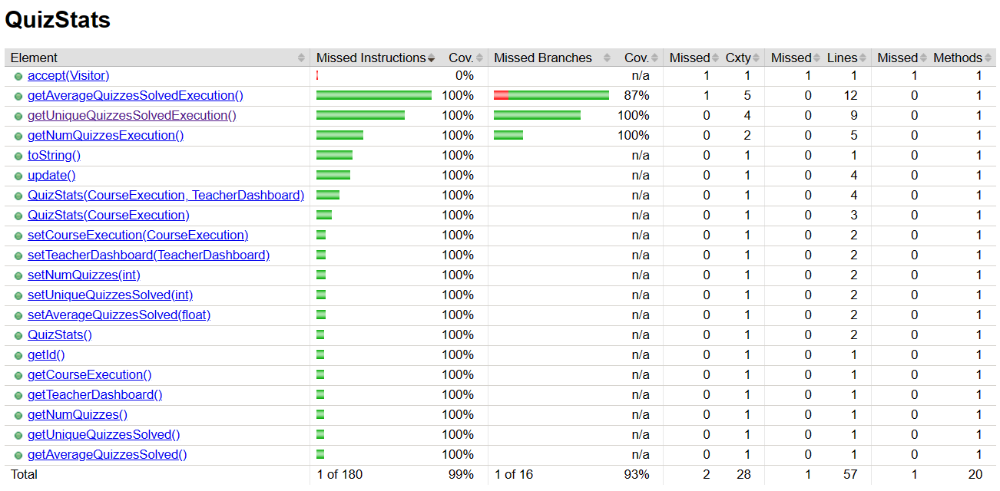
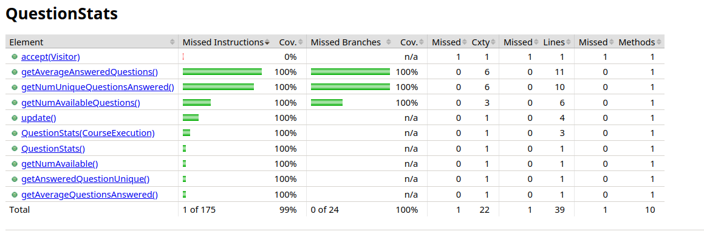

# ES P1 submission, Group 50

## Feature ESA

### Subgroup
 - Cláudio Cohen Campos, ist199192, [GitLab link](https://gitlab.rnl.tecnico.ulisboa.pt/ist199192)
   + Issues assigned: [#1](https://gitlab.rnl.tecnico.ulisboa.pt/es), [#3](https://gitlab.rnl.tecnico.ulisboa.pt/es)
 - Name, ist195671, [GitLab link](https://gitlab.rnl.tecnico.ulisboa.pt/ist195671)
   + Issues assigned: [#2](https://github.com), [#4](https://github.com)
 
### Merge requests associated with this feature

The list of pull requests associated with this feature is:

 - [MR #1](https://gitlab.rnl.tecnico.ulisboa.pt/es)
 - [MR #2](https://gitlab.rnl.tecnico.ulisboa.pt/es)
 - [MR #3](https://gitlab.rnl.tecnico.ulisboa.pt/es)

### Test Coverage Screenshot

The screenshot includes the test coverage results associated with the new/changed entities:

---

## Feature ESQ

### Subgroup
 - João Cardoso, ist199251, [GitLab link](https://gitlab.rnl.tecnico.ulisboa.pt/ist199251)
   + Issues assigned: [#34](https://gitlab.rnl.tecnico.ulisboa.pt/es/es23-50/-/issues/34), [#38](https://gitlab.rnl.tecnico.ulisboa.pt/es/es23-50/-/issues/38), [#49](https://gitlab.rnl.tecnico.ulisboa.pt/es/es23-50/-/issues/49), [#52](https://gitlab.rnl.tecnico.ulisboa.pt/es/es23-50/-/issues/52), [#55](https://gitlab.rnl.tecnico.ulisboa.pt/es/es23-50/-/issues/55)
 - José João Ferreira, ist199259, [GitLab link](https://gitlab.rnl.tecnico.ulisboa.pt/ist199259)
   + Issues assigned: [#20](https://gitlab.rnl.tecnico.ulisboa.pt/es/es23-50/-/issues/20), [#35](https://gitlab.rnl.tecnico.ulisboa.pt/es/es23-50/-/issues/35), [#38](https://gitlab.rnl.tecnico.ulisboa.pt/es/es23-50/-/issues/38), [#46](https://gitlab.rnl.tecnico.ulisboa.pt/es/es23-50/-/issues/46), [#49](https://gitlab.rnl.tecnico.ulisboa.pt/es/es23-50/-/issues/49), [#54](https://gitlab.rnl.tecnico.ulisboa.pt/es/es23-50/-/issues/54)
 
### Merge requests associated with this feature

The list of pull requests associated with this feature is:

 - [MR #2](https://gitlab.rnl.tecnico.ulisboa.pt/es/es23-50/-/merge_requests/2)
 - [MR #5](https://gitlab.rnl.tecnico.ulisboa.pt/es/es23-50/-/merge_requests/5)
 - [MR #8](https://gitlab.rnl.tecnico.ulisboa.pt/es/es23-50/-/merge_requests/8)
 

### Test Coverage Screenshot

The screenshot includes the test coverage results associated with the new/changed entities:

---

## Feature ESP

### Subgroup
 - Adriana Nunes, ist199172, [GitLab link](https://gitlab.rnl.tecnico.ulisboa.pt/ist199172)
   + Issues assigned: [#14](https://gitlab.rnl.tecnico.ulisboa.pt/es/es23-50/-/issues/14), [#17](https://gitlab.rnl.tecnico.ulisboa.pt/es/es23-50/-/issues/17), [#22](https://gitlab.rnl.tecnico.ulisboa.pt/es/es23-50/-/issues/22), [#28](https://gitlab.rnl.tecnico.ulisboa.pt/es/es23-50/-/issues/28), [#29](https://gitlab.rnl.tecnico.ulisboa.pt/es/es23-50/-/issues/29)
 - Francisco Carvalho, 199219, [GitLab link](https://gitlab.rnl.tecnico.ulisboa.pt/ist199219)
   + Issues assigned: [#15](https://gitlab.rnl.tecnico.ulisboa.pt/es/es23-50/-/issues/15), [#16](https://gitlab.rnl.tecnico.ulisboa.pt/es/es23-50/-/issues/16), [#24](https://gitlab.rnl.tecnico.ulisboa.pt/es/es23-50/-/issues/24), [#25](https://gitlab.rnl.tecnico.ulisboa.pt/es/es23-50/-/issues/25), [#26](https://gitlab.rnl.tecnico.ulisboa.pt/es/es23-50/-/issues/26)
 
### Merge requests associated with this feature

The list of pull requests associated with this feature is:

 - [MR #1](https://gitlab.rnl.tecnico.ulisboa.pt/es/es23-50/-/merge_requests/1)
 - [MR #6](https://gitlab.rnl.tecnico.ulisboa.pt/es/es23-50/-/merge_requests/6)
 - [MR #7](https://gitlab.rnl.tecnico.ulisboa.pt/es/es23-50/-/merge_requests/7)

### Test Coverage Screenshot

The screenshot includes the test coverage results associated with the new/changed entities:

---