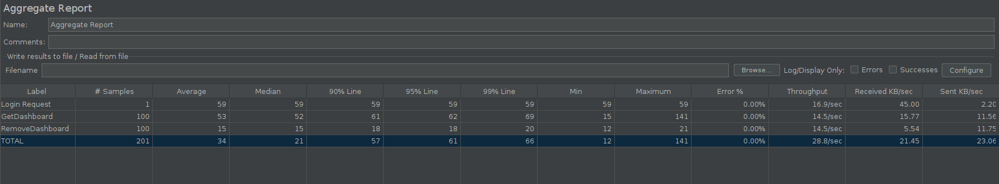
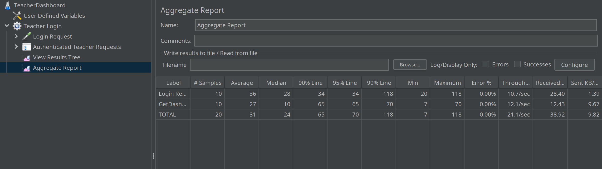

# ES P3 submission, Group 50

## Did your group use the base code provided?

**Yes**

## Feature ESA

### Subgroup
- Cláudio Cohen Campos, ist199192, [GitLab link](https://gitlab.rnl.tecnico.ulisboa.pt/ist199192)
  + Issues assigned:
  - [#89](https://gitlab.rnl.tecnico.ulisboa.pt/es/es23-50/-/issues/89)
  - [#93](https://gitlab.rnl.tecnico.ulisboa.pt/es/es23-50/-/issues/93)
  - [#94](https://gitlab.rnl.tecnico.ulisboa.pt/es/es23-50/-/issues/94)
  - [#97](https://gitlab.rnl.tecnico.ulisboa.pt/es/es23-50/-/issues/97)
  - [#102](https://gitlab.rnl.tecnico.ulisboa.pt/es/es23-50/-/issues/102)

- Rui Gouveia Maciel, ist195671, [GitLab link](https://gitlab.rnl.tecnico.ulisboa.pt/ist195671)
  + Issues assigned:
  - [#89](https://gitlab.rnl.tecnico.ulisboa.pt/es/es23-50/-/issues/89)
  - [#93](https://gitlab.rnl.tecnico.ulisboa.pt/es/es23-50/-/issues/93)
  - [#104](https://gitlab.rnl.tecnico.ulisboa.pt/es/es23-50/-/issues/104)
  - [#105](https://gitlab.rnl.tecnico.ulisboa.pt/es/es23-50/-/issues/105)

### Merge requests associated with this feature

The list of pull requests associated with this feature is:

- [MR #27](https://gitlab.rnl.tecnico.ulisboa.pt/es/es23-50/-/merge_requests/27)

### JMeter Load test

- JMeter test: update
  

### Cypress end-to-end tests

- Data initialization:
  - We initialized the data for our tests using the populateDemo() method

- [Cypress test 1](https://gitlab.rnl.tecnico.ulisboa.pt/es/es23-50/-/blob/master/frontend/tests/e2e/specs/dashboard/1TeacherDashboard.js)

---

## Feature ESQ

### Subgroup
- João Cardoso, ist199251, [GitLab link](https://gitlab.rnl.tecnico.ulisboa.pt/ist199251)
  + Issues assigned:
  - [#88](https://gitlab.rnl.tecnico.ulisboa.pt/es/es23-50/-/issues/88)
  - [#89](https://gitlab.rnl.tecnico.ulisboa.pt/es/es23-50/-/issues/89)
  - [#90](https://gitlab.rnl.tecnico.ulisboa.pt/es/es23-50/-/issues/90)
  - [#95](https://gitlab.rnl.tecnico.ulisboa.pt/es/es23-50/-/issues/95)
  - [#98](https://gitlab.rnl.tecnico.ulisboa.pt/es/es23-50/-/issues/98)
  - [#103](https://gitlab.rnl.tecnico.ulisboa.pt/es/es23-50/-/issues/103)

- José João Ferreira, ist199259, [GitLab link](https://gitlab.rnl.tecnico.ulisboa.pt/ist199259)
  + Issues assigned:
  - [#88](https://gitlab.rnl.tecnico.ulisboa.pt/es/es23-50/-/issues/88)
  - [#89](https://gitlab.rnl.tecnico.ulisboa.pt/es/es23-50/-/issues/89)
  - [#95](https://gitlab.rnl.tecnico.ulisboa.pt/es/es23-50/-/issues/95)
  - [#96](https://gitlab.rnl.tecnico.ulisboa.pt/es/es23-50/-/issues/96)
  - [#103](https://gitlab.rnl.tecnico.ulisboa.pt/es/es23-50/-/issues/103)
  - [#106](https://gitlab.rnl.tecnico.ulisboa.pt/es/es23-50/-/issues/106)
  - [#107](https://gitlab.rnl.tecnico.ulisboa.pt/es/es23-50/-/issues/107)

### Merge requests associated with this feature

The list of pull requests associated with this feature is:

- [MR #25](https://gitlab.rnl.tecnico.ulisboa.pt/es/es23-50/-/merge_requests/25)
- [MR #28](https://gitlab.rnl.tecnico.ulisboa.pt/es/es23-50/-/merge_requests/28)

### JMeter Load test

- JMeter test: create → remove
  

### Cypress end-to-end tests

- Data initialization:
  We initialized the data for our tests using the populateDemo() method in [DemoService.java](../backend/src/main/java/pt/ulisboa/tecnico/socialsoftware/tutor/demo/DemoService.java). To make sure that our tests could run, we had to change the admin E2E test that runs before our own ([2TeacherDashboard.js](../frontend/tests/e2e/specs/dashboard/2TeacherDashboard.js)) because it was deleting the demo data after running.

- [Cypress test 2](https://gitlab.rnl.tecnico.ulisboa.pt/es/es23-50/-/blob/master/frontend/tests/e2e/specs/dashboard/2TeacherDashboard.js)

---

## Feature ESP

### Subgroup
- Adriana Nunes, ist199172, [GitLab link](https://gitlab.rnl.tecnico.ulisboa.pt/ist199172)
  + Issues assigned:
  - [#89](https://gitlab.rnl.tecnico.ulisboa.pt/es/es23-50/-/issues/89)
  - [#91](https://gitlab.rnl.tecnico.ulisboa.pt/es/es23-50/-/issues/91)
  - [#92](https://gitlab.rnl.tecnico.ulisboa.pt/es/es23-50/-/issues/92)
  - [#99](https://gitlab.rnl.tecnico.ulisboa.pt/es/es23-50/-/issues/99)
  - [#101](https://gitlab.rnl.tecnico.ulisboa.pt/es/es23-50/-/issues/101)
- Francisco Carvalho, ist199219, [GitLab link](https://gitlab.rnl.tecnico.ulisboa.pt/ist199219)
  + Issues assigned:
  - [#89](https://gitlab.rnl.tecnico.ulisboa.pt/es/es23-50/-/issues/89)
  - [#91](https://gitlab.rnl.tecnico.ulisboa.pt/es/es23-50/-/issues/91)
  - [#92](https://gitlab.rnl.tecnico.ulisboa.pt/es/es23-50/-/issues/92)
  - [#99](https://gitlab.rnl.tecnico.ulisboa.pt/es/es23-50/-/issues/99)
  - [#100](https://gitlab.rnl.tecnico.ulisboa.pt/es/es23-50/-/issues/100)

### Merge requests associated with this feature

The list of pull requests associated with this feature is:

- [MR #26](https://gitlab.rnl.tecnico.ulisboa.pt/es/es23-50/-/merge_requests/26)

### JMeter Load test

- JMeter test: get
  

### Cypress end-to-end tests

- Data initialization:
  We used the commands to initialize the data for our tests. Before and after the tests, we had to delete some contents of the database.

- [Cypress test 3](https://gitlab.rnl.tecnico.ulisboa.pt/es/es23-50/-/blob/master/frontend/tests/e2e/specs/dashboard/3TeacherDashboard.js)

---